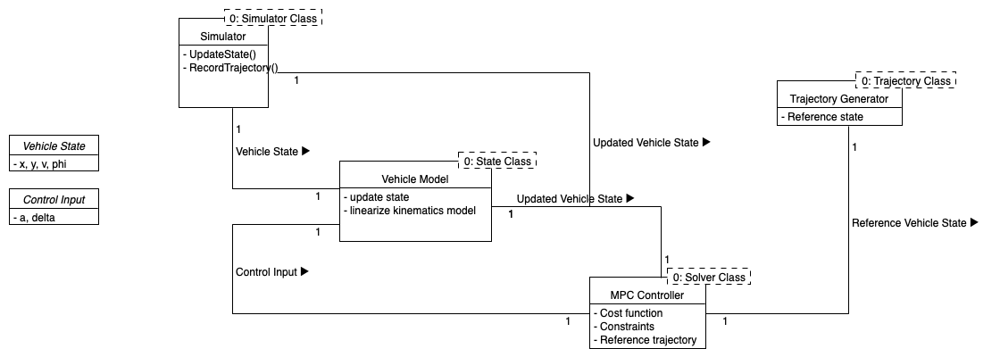

## MPC for Automated Valet Parking
Our EECS 561 (Digital Controls) final project.

## Setup
Make a python virtual environment (type `deactivate` to exit the venv):
```
cd ${your virtual envrironment directory}
python3 -m venv eecs561
source eecs561/bin/activate
```

Install and run:
```
cd ${your desired directory for this project}
git clone https://github.com/stevenliu216/EECS561-final-project.git
pip install -r requirements.txt

python main.py
```

## Run unit tests
From main directory, run:
```
pytest -v
```

## Diagram

